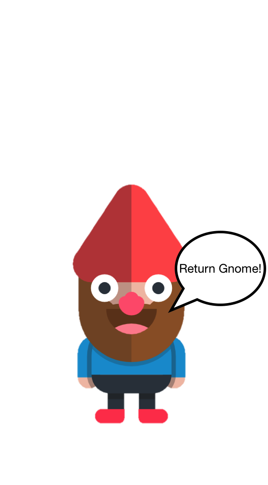

<<<<<<< HEAD
# 

In Return Gnome!, a fairy has taken control of the forest and keeps moving the gnomes' homes to random places. Players needs to help them get back home using their flexbox skills.

# Dynamic jQuery

The gnome(s) on the right change dynamically just like if you were writing CSS in Chrome Dev Tools.

Removing styling changes the gnomes! When you get the wrong answer you can fix it right away.

# Local storage

Remember where you left off when you refresh.

Local storage will be later used to fill in  answers for levels that have been completed.

# Architecture and Frameworks

* Used jQuery for most of the game logic
* Implemented Animate.css to provide animations

# Future Additions

More CSS techniques other than flex and transform.
Better use of local storage to manage game sessions.
